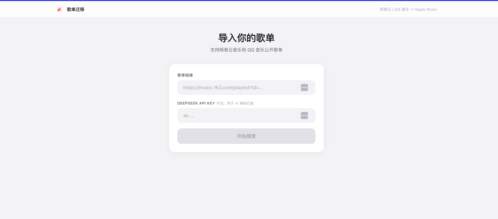
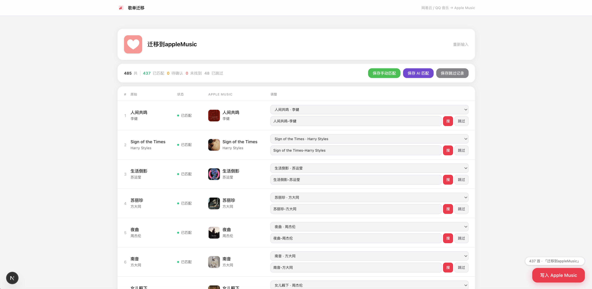

# 歌单迁移工具

将网易云音乐 / QQ 音乐歌单一键迁移到 Apple Music。

## 截图





## 功能

- 输入歌单链接自动抓取所有歌曲
- 批量搜索 iTunes，实时显示匹配进度
- 匹配状态分级：已匹配 / 待确认 / 未找到
- DeepSeek AI 辅助二次搜索，提升匹配率
- 支持手动搜索 & 候选切换
- 匹配结果本地缓存（`matched.json`），下次跳过已知歌曲
- 跳过记录持久化（`skipped.json`）
- 通过 AppleScript 直接写入 Music.app

## 技术栈

- Next.js 16 · TypeScript · Tailwind CSS
- iTunes Search API
- DeepSeek Chat API
- osascript / AppleScript

## 使用前提

- macOS（AppleScript 写入 Music.app 需要）
- 已安装 Node.js 18+
- Music.app 已登录 Apple Music 账号
- （可选）DeepSeek API Key，用于 AI 辅助匹配

## 快速开始

```bash
npm install
npm run dev
```

打开 [http://localhost:3000](http://localhost:3000)，粘贴网易云或 QQ 音乐歌单链接即可。

## 使用流程

1. 粘贴歌单链接，填入 DeepSeek API Key（可选）
2. 点击「开始搜索」，等待批量匹配完成
3. 若「待确认」/「未找到」较多，点击「重新搜索」再试几次（已匹配的不会重复搜索）
4. 仍有问题的歌曲点击「AI 辅助搜索」，由 DeepSeek 辅助查找
5. 手动调整剩余问题歌曲，或标记跳过
6. 点击右下角「写入 Apple Music」

## 缓存文件

| 文件 | 说明 |
|------|------|
| `matched.json` | 已匹配歌曲缓存，避免重复搜索 |
| `skipped.json` | 跳过歌曲记录，下次自动跳过 |

这两个文件已加入 `.gitignore`，不会上传。

## 注意事项

- DeepSeek API Key 仅在本地使用，不会上传或存储
- 歌单须为**公开**歌单
- 写入 Music.app 时请保持 Music 在后台运行
